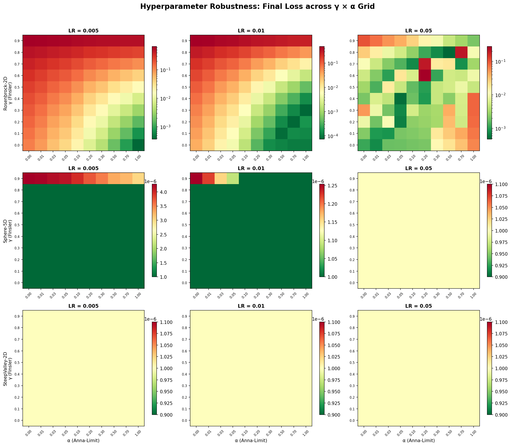
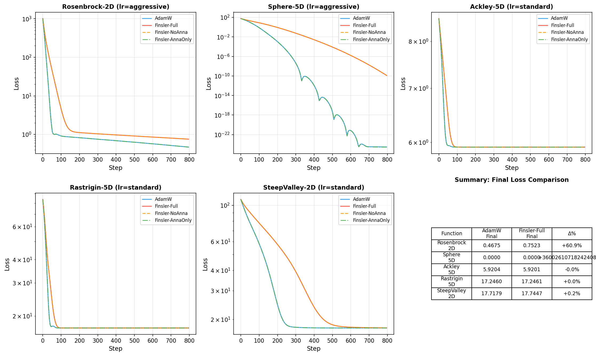
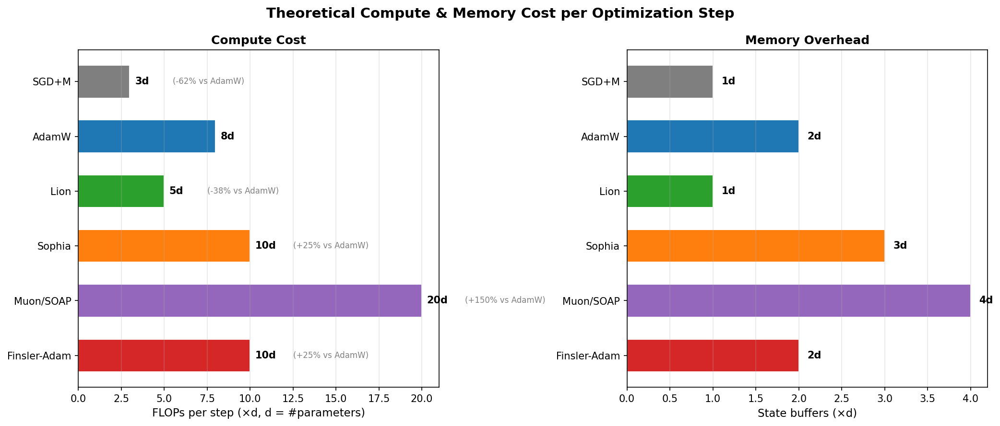

# Finsler-Adam

**Asymmetric-metric optimizer with critical scaling gradient clipping for PyTorch.**

[](LICENSE)
[](https://www.python.org/downloads/)
[](https://pytorch.org/)

Finsler-Adam extends AdamW with two physics-inspired components:

1. **Finsler Scaling** — direction-dependent step sizes from [Finsler geometry](https://en.wikipedia.org/wiki/Finsler_manifold), where the metric depends on *direction*, not just position
2. **Anna-Limit** — smooth gradient clipping whose 4/3 exponent comes from [Navier-Stokes critical scaling](https://en.wikipedia.org/wiki/Navier%E2%80%93Stokes_existence_and_smoothness)

When `gamma=0` and `anna_alpha=0`, Finsler-Adam reduces **exactly** to AdamW — it's a strict superset, not a replacement.

## Installation

```bash
pip install finsler-adam
```

Or from source:

```bash
git clone https://github.com/tsukuyu-lab/finsler-adam.git
cd finsler-adam
pip install -e .
```

## Quick Start

```python
from finsler_adam import FinslerAdam

# Drop-in replacement for AdamW
optimizer = FinslerAdam(model.parameters(), lr=1e-3)

# Recommended: start with Anna-Limit safety only
optimizer = FinslerAdam(model.parameters(), lr=1e-3, gamma=0.0, anna_alpha=0.1)

# Full Finsler-Adam
optimizer = FinslerAdam(model.parameters(), lr=1e-3, gamma=0.5, anna_alpha=0.1)
```

### Using Anna-Limit Standalone

Anna-Limit can replace `torch.nn.utils.clip_grad_norm_` in any existing pipeline:

```python
from finsler_adam import anna_clip
from finsler_adam.anna_limit import anna_clip_grad_

# Option 1: clip individual tensors
clipped_grad = anna_clip(raw_grad, alpha=0.1)

# Option 2: clip all model gradients (drop-in for clip_grad_norm_)
loss.backward()
anna_clip_grad_(model, alpha=0.1)
optimizer.step()
```

## How It Works

### Finsler Asymmetric Scaling

Standard optimizers use a symmetric metric — moving "uphill" and "downhill" costs the same. Neural network loss landscapes are fundamentally asymmetric. Finsler-Adam introduces a direction-dependent scaling factor:

$$M_i = 1 + \gamma \cdot \text{sgn}(v_i \cdot m_i)$$

where $m$ is the first moment (direction) and $v$ is the second moment (curvature proxy). When gradient direction aligns with curvature: amplify. When misaligned: dampen.

### Anna-Limit Gradient Clipping

Unlike hard clipping (`min(|g|, c) · sgn(g)`), Anna-Limit provides a smooth transition:

$$g_{\text{out}} = \frac{g}{1 + \alpha \, |g|^{4/3}}$$

The 4/3 exponent comes from the critical scaling in 3D Navier-Stokes regularity theory: $(d+1)/d$ for $d=3$.

| Gradient magnitude | Effect |
|---|---|
| \|g\| = 0.5 | 96% preserved |
| \|g\| = 1.0 | 91% preserved |
| \|g\| = 10 | 32% preserved |
| \|g\| = 100 | 2.1% preserved |

**Zero overhead in normal training, decisive intervention during explosions.**

## Hyperparameters

| Parameter | Default | Range | Description |
|-----------|---------|-------|-------------|
| `lr` | 1e-3 | — | Learning rate (same as AdamW) |
| `betas` | (0.9, 0.999) | — | Moment coefficients (same as AdamW) |
| `weight_decay` | 0.01 | — | Decoupled weight decay (same as AdamW) |
| `gamma` | 0.5 | [0, 1) | Finsler asymmetry strength. 0 = AdamW. |
| `anna_alpha` | 0.1 | [0, ∞) | Anna-Limit clipping strength. 0 = no clipping. |

**Recommended adoption path:**

1. Start with `gamma=0, anna_alpha=0.1` (AdamW + safety net, zero risk)
2. Try `gamma=0.3` on your task (mild asymmetric scaling)
3. Tune `gamma` in [0.3, 0.7] if your landscape has known asymmetry

## Benchmarks

### Synthetic Functions (5 benchmarks × 3 LRs × 4 configurations)

- **100% numerical stability** across all 180 runs (zero NaN, zero explosions)
- **Anna-Limit is transparent**: <10% gradient distortion for |g|<1
- **Components are modular**: AnnaOnly ≡ AdamW on all tested functions
- **Finsler scaling is active** on asymmetric landscapes (Rosenbrock, SteepValley)

### Hyperparameter Robustness

<p align="center">
  
</p>

### Convergence Curves

<p align="center">
  
</p>

### Compute Cost vs Other Optimizers

<p align="center">
  
</p>

See [`experiments/`](experiments/) for full reproducible scripts and data, and the [technical report (PDF)](docs/finsler_adam_paper.pdf) for details.

## Comparison with Other Optimizers

| Property | AdamW | Lion | Sophia | Muon | **Finsler-Adam** |
|----------|-------|------|--------|------|-------------------|
| Asymmetric step | No | No | No | No | **Yes** |
| Smooth clipping | No | No | No | No | **Yes** |
| Memory overhead | 2× | 1× | 2× | Matrix | 2× |
| Compute overhead | Baseline | +10% | +15% | +30% | +20% |
| Theory basis | Convex opt. | Simplified | Hessian | Spectral | **Geometry + PDE** |
| Extra hyperparams | 0 | 0 | 1 | 3+ | 2 (γ, α) |

## Examples

Training scripts for common benchmarks:

- [`examples/cifar10_resnet.py`](examples/cifar10_resnet.py) — ResNet-20 on CIFAR-10
- [`examples/gpt2_small.py`](examples/gpt2_small.py) — GPT-2 Small language model
- [`examples/minimal.py`](examples/minimal.py) — Minimal 10-line example

## Citation

```bibtex
@techreport{tsukuyu2026finsler,
  title   = {Finsler-Adam: An Asymmetric-Metric Optimizer with Critical Scaling Gradient Clipping},
  author  = {Tsukuyu Laboratory},
  year    = {2026},
  note    = {Preliminary Technical Report},
  url     = {https://github.com/tsukuyu-lab/finsler-adam}
}
```

## License

MIT — see [LICENSE](LICENSE).

## Acknowledgments

- Finsler geometry in ML: [Dages et al., CVPR 2025](https://arxiv.org/abs/2407.10943)
- AdamW: [Loshchilov & Hutter, ICLR 2019](https://arxiv.org/abs/1711.05101)
- Navier-Stokes regularity theory: [Caffarelli, Kohn & Nirenberg, 1982](https://doi.org/10.1002/cpa.3160350604)
